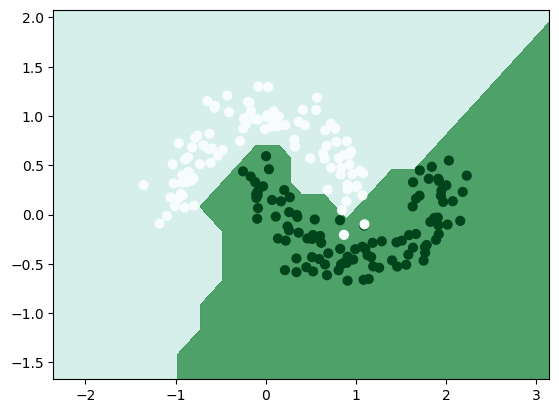
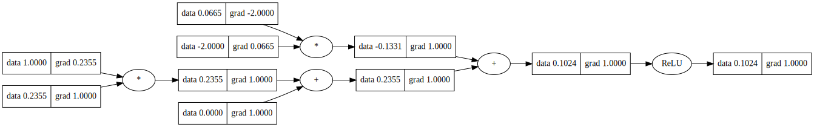

# micrograd


A tiny Autograd engine (with a neural net example) in < 100 lines of Python. This is a minimalistic implementation of a reverse-mode autograd engine, with a neural net example. The engine is implemented in the `micrograd.engine` module, and the neural net in the `micrograd.nn` module.

## Components:

* Autograd Engine: The heart of TinyGrad, a tiny yet powerful Autograd engine, facilitates reverse-mode autodiff through a dynamically constructed DAG.

* Neural Networks Library: A small neural networks library built on top of the Autograd engine. It includes modules for creating layers, neurons, and multi-layer perceptrons (MLPs) with ease.

### Example usage

Below is a slightly contrived example showing a number of possible supported operations:

```python
from micrograd.engine import Value

a = Value(-4.0)
b = Value(2.0)
c = a + b
d = a * b + b**3
c += c + 1
c += 1 + c + (-a)
d += d * 2 + (b + a).relu()
d += 3 * d + (b - a).relu()
e = c - d
f = e**2
g = f / 2.0
g += 10.0 / f
print(f'{g.data:.4f}') # prints 24.7041, the outcome of this forward pass
g.backward()
print(f'{a.grad:.4f}') # prints 138.8338, i.e. the numerical value of dg/da
print(f'{b.grad:.4f}') # prints 645.5773, i.e. the numerical value of dg/db
```

### Training a neural net

The notebook `classification_demo.ipynb` provides a full demo of training an 2-layer neural network (MLP) binary classifier. This is achieved by initializing a neural net from `micrograd.nn` module, implementing a simple svm "max-margin" binary classification loss and using SGD for optimization. 



### Tracing / visualization

For added convenience, the notebook `trace_graph.ipynb` produces graphviz visualizations. E.g. this one below is of a simple 2D neuron, arrived at by calling `draw_graph` on the code below, and it shows both the data (left number in each node) and the gradient (right number in each node).

```python
from micrograd import nn
n = nn.Neuron(2)
x = [Value(1.0), Value(-2.0)]
y = n(x)
draw_graph(y)
```



### Running tests

To run the unit tests you will have to install [PyTorch](https://pytorch.org/), which the tests use as a reference for verifying the correctness of the calculated gradients. Then simply:

```bash
python -m pytest
```
